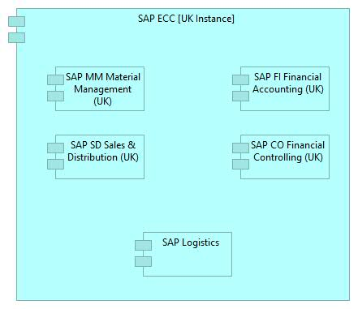

# **Nobia Application Landscape**

This repository contains the Nobia Applciation Landscape model.

This model has been built using the ArchiMate modelling language and the Archi modelling tool.

More information about the ArchiMate language can be found [here](http://pubs.opengroup.org/architecture/archimate3-doc/toc.html)

The Archi modelling tool that is used can be downloaded from [here](https://www.archimatetool.com/)

## *ArchiMate at Nobia* ##

The ArchiMate modelling language is designed to allow users to model the Application, Business, Technology layers of an IT architecture. In addition, it provides *extensions* that allow for modelling of Motivation, Implementation and Strategic elements of an architecture. In effect the full ArchiMate specifcation allows for high-level modelling of *anything* that might relate to an IT system/change.

Based on Nobia's requirements and to ease adoption we have decided to use a subset of the full ArchiMate notation when building the Nobia Enterprise Application Model (as per the diagram below).

Each element in this standard model is described below-

### Application Component ####

This is the common symbol used to represent 'Applications'. The definition of what consititues an 'Application' can be subjective (depending on what the Architect is looking to describe). In the case of the Nobia Enterprise 'Applications' represent software products, from a particular software vendor that serve a particular business unit or function. For example, we refer to the various PRMS systems by their numbers (PRMS52, PRMS61 etc) and each of these systems serve a particular brand. 

In some cases the application may well support multiple business functions, and may be modular in its internal structure. In this case it may be useful to represent the sub-modules as Application Components in their own right. A good example of this is SAP ECC as shown below.

### Business Actor ###

