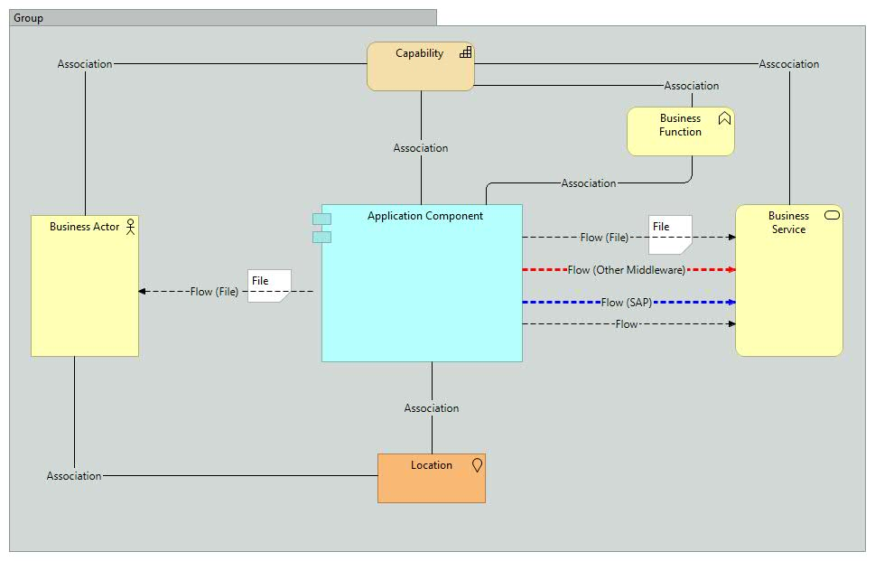
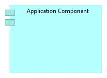
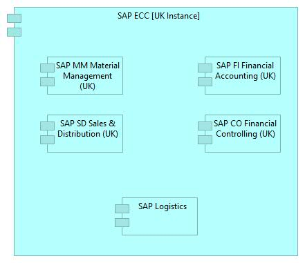
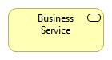
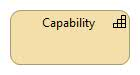
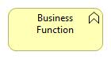
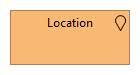

# **Nobia Application Landscape**

This repository contains the Nobia Applciation Landscape model.

This model has been built using the ArchiMate modelling language and the Archi modelling tool.

More information about the ArchiMate language can be found [here](http://pubs.opengroup.org/architecture/archimate3-doc/toc.html)

The Archi modelling tool that is used can be downloaded from [here](https://www.archimatetool.com/)

## *ArchiMate at Nobia* ##

The ArchiMate modelling language is designed to allow users to model the Application, Business, Technology layers of an IT architecture. In addition, it provides *extensions* that allow for modelling of Motivation, Implementation and Strategic elements of an architecture. In effect the full ArchiMate specifcation allows for high-level modelling of *anything* that might relate to an IT system/change.

Based on Nobia's requirements and to ease adoption we have decided to use a subset of the full ArchiMate notation when building the Nobia Enterprise Application Model (as per the diagram below).

Each element in this standard model is described below-

### Application Components ####

This is the common symbol used to represent 'Applications'. The definition of what consititues an 'Application' can be subjective (depending on what the Architect is looking to describe). In the context of the Nobia Enterprise Model 'Applications' represent software products, from a particular software vendor that serve a particular business unit or function. For example, we refer to the various PRMS systems by their numbers (PRMS52, PRMS61 etc) and each of these systems serve a particular brand. 

In some cases the application may well support multiple business functions, and may be modular in its internal structure. In this case it may be useful to represent the sub-modules as Application Components in their own right. A good example of this is SAP ECC as shown below.

### Business Actors ###

A business actor is used to represent a generic role or group of indivduals that send data to or receive data from a Nobia system. In our Nobia model Actors genrally represent an internal business role/department e.g. 'Payroll Manager' or a generic representation of third-parties e.g 'B2B Customers'

### Business Services ###

In the Nobia Application Model the business service symbol is used represent external third-party service providers that we send data to and receive data from. The business service generally does something with the data and returns a response to us via an interface **but** Nobia have no resposnibilty for the underlying applications or infrastructure used by the third-party to provide support for the service. Examples of business service provider are Adyen (PSP used by Magnet) or Customer IO (Email Service provider used with the Magnet website/Digital tools).

### Business Capabilities ###

Business capabilities are used in the Nobia Architect model to represent broad groupings of business functionality and business functions and the services they provide to the business. For example, within a retailer Merchandisng can be described a capabilty, which in turn can be broken down into sub-capabilities such as 'Range Management', 'Price Management', 'Sales Forecasting' etc. In the Nobia Application Model data doesn't flow/to from Capabilities but instead Applications, Business Functions ect are *asscociated* with Capabilities.

### Business Functions ###

This notation is used to describe logical groupings of business fucntionality that may map directly on to a single application (or may be spread accross multiple applications). Accounts Payable is an example of business function.

### Location ###

Within the As Is Nobia IT Landscape there is generallly a strong asscociation between Applications and particular Geographies/Locations, so this element can be included in the the Enterprise Application model where appropriate. The expectation would be that this element will become less relevant over time.

