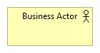

# **Nobia Application Landscape**

This repository contains the Nobia Application Landscape model.

This model has been built using the ArchiMate modelling language and the Archi modelling tool.

More information about the ArchiMate language can be found [here](http://pubs.opengroup.org/architecture/archimate3-doc/toc.html)

The Archi modelling tool that has been used to build this model can be downloaded from [here](https://www.archimatetool.com/)

## *ArchiMate at Nobia* ##

The ArchiMate modelling language is designed to allow users to model the Application, Business, Technology layers of an IT architecture. In addition, it provides *extensions* that allow for modelling of Motivation, Implementation and Strategic aspects of an IT architecture. In effect the full ArchiMate specification allows for high-level modelling of *anything* that might relate to an IT system/change.

Based on Nobia's requirements and to ease adoption we have decided to use a subset of the full ArchiMate notation when building the Nobia Enterprise Application Model (as per the diagram below).

Each element in this standard model is described below-

### Application Components ####

This is the common symbol used to represent 'Applications'. The definition of what constitutes an 'Application' can be subjective (depending on what the Architect is looking to describe). In the context of the Nobia Enterprise Model 'Applications' generally represent software products, often developed by a particular software vendor that serve a particular business unit or function. For example, we refer to the various PRMS systems by their numbers (PRMS52, PRMS61 etc) and each of these systems serve a particular brand. 

In some cases the application may support multiple business functions, and may be modular in its internal structure. In this case it may be useful to represent the sub-modules as Application Components in their own right. A good example of this is SAP ECC as shown below.

### Relationships ###

#### Line Types ####

The Archimate notation provides support for modelling a vast array of relationship types between components within a model.
For the sake of simplicity we have decided to use one of two relationship types in our models.

- *Flows* - These lines represent the flow of information between components. They are represented as dotted lines with an arrow-head denoting the direction of the flow

- *Associations*- These are lines are used to represent where components are *associated*. These relations are represented as a single solid line with no directional arrow (as this is just a generic/logical link).

#### Flow Types ####

When adding flows to our Nobia models we will use the following notation to provide some indication of how the flow is implemented from a technology perspective. All flows should be labelled with a high-level description of the type of data that is flowing e.g. Customer, Invoices etc.

- *Blue Arrows* are data flows that are implemented using a SAP Middleware component such as PO. 

- *Red Arrows* are data flows that implemented using a non-SAP Middleware component such as iCore.

- *Grey Arrows* are flows that don't pass through a middleware component e.g. where a files is dumped into a shared folder somewhere to be picked up by another **system process**

- *Grey Arrows with a file* are flows where a file is produced by a system and picked up by a **business actor**

### Business Actors ###

A business actor is used to represent a generic role or group of individuals that send data to or receive data from a Nobia system. In our Nobia model Actors generally represent an internal business role/department e.g. 'Payroll Manager' or a generic representation of third-parties e.g 'B2B Customers'

### Business Services ###

In the Nobia Application Model the business service symbol is used represent external third-party service providers that we send data to and receive data from. The business service generally does something with the data and returns a response to us via an interface **but** Nobia have no responsibility for the underlying applications or infrastructure used by the third-party to provide support for the service. Examples of business service providers are Adyen (PSP used by Magnet) or Customer IO (Email Service provider used with the Nobia websites/Digital tools).

### Business Capabilities ###

Business capabilities are used in the Nobia Architecture model to represent business functions/departments and the services they provide to the business. For example, within a retailer 'Merchandising' can be described a capability, which in turn can be broken down into sub-capabilities such as 'Range Management', 'Price Management', 'Sales Forecasting' etc. In the Nobia Architecture Model data doesn't flow/to from Capabilities but instead Applications, Business Functions etc are *associated* with Capabilities.

### Business Functions ###

This notation is used to describe logical groupings of business functionality that *may* map directly on to a single application (or may be spread across multiple applications). Accounts Payable is an example of business function.

### Locations ###

Within the As Is Nobia IT Landscape there is generally a strong association between Application Components and particular Geographies/Locations, so this element can be included in the the Enterprise Application model where appropriate. The expectation would be that this element will become less relevant over time.

